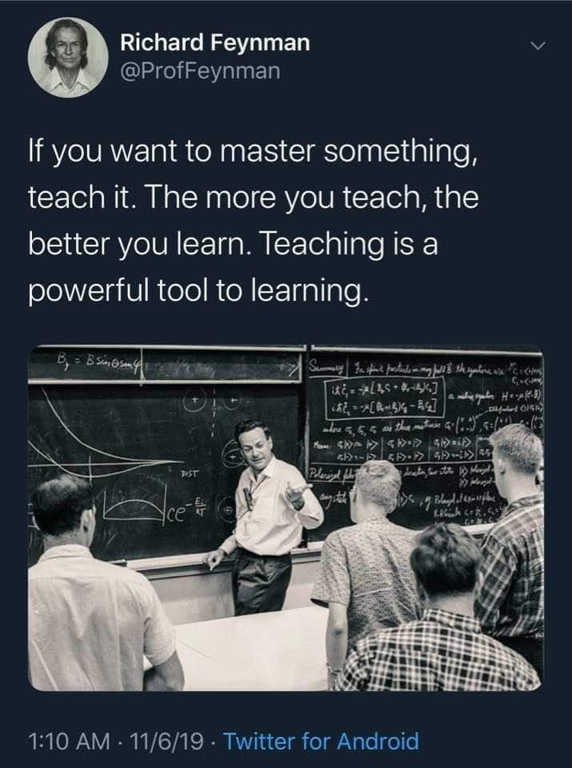

# DL-basic

## Introduction

> **가장 좋은 공부 방법은 가르치는 것이다. 가르치는 것은 강력한 학습 방법이다**

딥러닝을 독학하면서 구체적이고 명확한 개념서를 만들어 다른 사람에게 설명하고 있다고 가정하며 만든 기본 개념서입니다.

- 제 블로그[https://pervin0527.notion.site/DL-Basic](https://pervin0527.notion.site/DL-Basic-74b607d4da2443b581313b93f7281926?pvs=4) 에서 주제별로 정리한 포스트를 볼 수 있습니다.
- Repository에 있는 코드는 Python과 Pytorch로 작성되어 있습니다.

## Contents
### 1. Forward, BackPropagation
 - Post
    - [Forward Propagation](https://www.notion.so/pervin0527/Forward-Propagation-baf858f884a4414fb7b410a6fbc20797?pvs=4)
    - [Derivative For Backpropagation](https://www.notion.so/pervin0527/Derivative-for-backpropagation-84ea9dfc83f940548556cb89bbc83512?pvs=4)
    - [BackPropagation](https://www.notion.so/pervin0527/BackPropagation-127aa0aa3f5346e585a456b3533a9a5c?pvs=4)
 - Code
    - [01-Basic & Logistic Regression](./01-Basic%20&%20Logistic%20Regression.ipynb)
    - [02-Multi layer logistic regression](./02-Multi%20layer%20logistic%20regression.ipynb)

### 2.Activation functions & Optimizer
 - [Post](https://www.notion.so/pervin0527/Activation-func-Optimizer-15f287f718874981b008d064f79888b4?pvs=4)
 - [Code](./03-Activation%20functions%20&%20Optimizers.ipynb)

### 3.Data Pre-Processing, Weight Initialization
 - [Post](https://www.notion.so/pervin0527/Data-Preprocessing-Weight-Initialization-21aba2d2e3544d1f8bb6b5dc47fe299d?pvs=4)
 - [Code](./04-Data%20Preprocessing%20&%20Weight%20Initialization.ipynb)

### 4. Validation, Test dataset / Overfitting & Underfitting / Regularization
 - [Post](https://www.notion.so/pervin0527/Valid-Test-set-Overfitting-Underfitting-Regularization-05d8dc0de7f342c090c7d3ac8db3976e?pvs=4)
 - [Code](./05-Test%20set,%20Overfitting%20&%20Underfitting,%20Regularization.ipynb)

### 5.Convolutional Neural Network
 - [Post](https://www.notion.so/pervin0527/Convolutional-Neural-Network-67e0c27e835947b28ab94d76f46f813a?pvs=4)
 - [Code](./06-Convolutional%20Neural%20Networks.ipynb)

### 6.BatchNormalization
 - [Post](https://www.notion.so/pervin0527/Batch-Normalization-155285bf5a7545e490dcf45b3c40a5ac?pvs=4)
 - [Code](./07-BatchNormalization.ipynb)

### 7.VGGNet - Very Deep Convolutional Neural Network
 - [Post](https://www.notion.so/pervin0527/VGGNet-Very-Deep-Convolutional-networks-for-Large-Scale-image-recognition-8e88e520424248b4bc6cba2aad72246b)
 - [Code](./08-Very Deep Convolutional Networks for Large Scale Image Recognition.ipynb)

### 8.ResNet - Residual Learning for Image Recongnition
 - [Post](https://pervin0527.notion.site/ResNet-Deep-Residual-Learning-for-Image-Recognition-fc83704e70254d3499acb285efbe582b?pvs=4)
 - [Code](./09-Deep%20Residual%20Learning%20for%20Image%20Recognition.ipynb)

### 9.MobileNet - Efficient Convolutional Neural Networks for Mobile Vision Applications
 - [Post](https://pervin0527.notion.site/MobileNet-Efficient-Convolutional-Neural-Networks-for-Mobile-Vision-Applications-e119194461844079ad5b08732d1d2fe7?pvs=4)
 - [Code](./10-Efficient%20Convolutional%20Neural%20Networks%20for%20Mobile%20Vision%20Applications.ipynb)

### 10.MobileNetV2 - Inverted Residuals and Linear Bottlenecks
 - [Post](https://pervin0527.notion.site/MobileNetV2-Inverted-Residuals-and-Linear-Bottlenecks-40da4063ea724dafb12d3554c55d9f2f?pvs=4)
 - [Code](./11-Inverted%20Residuals%20and%20Linear%20Bottlenecks.ipynb)